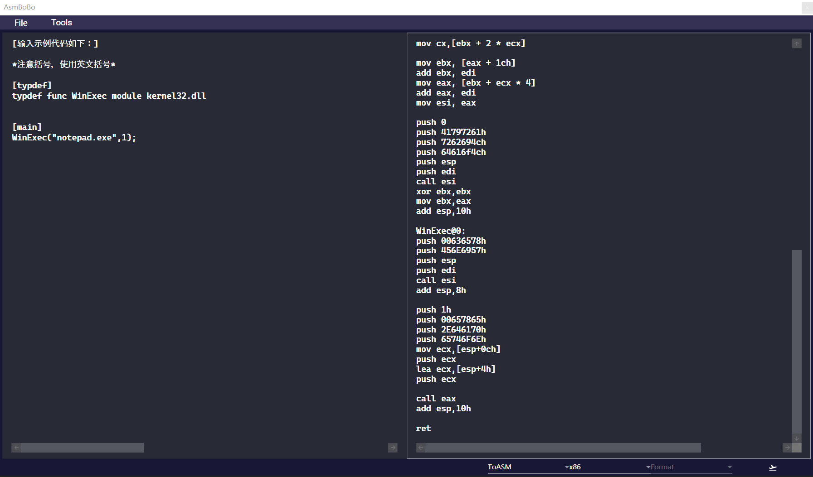
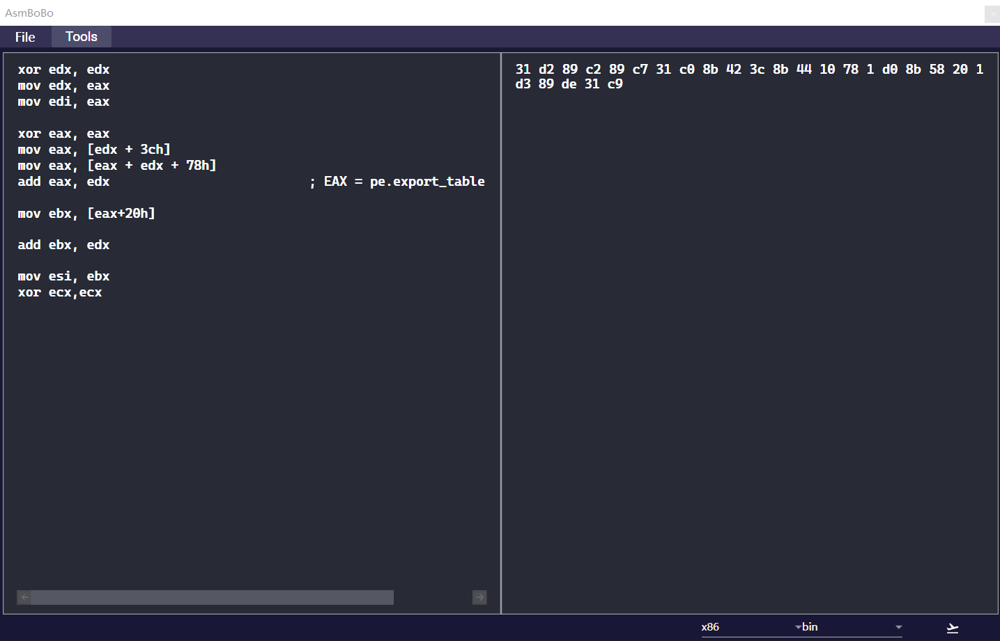
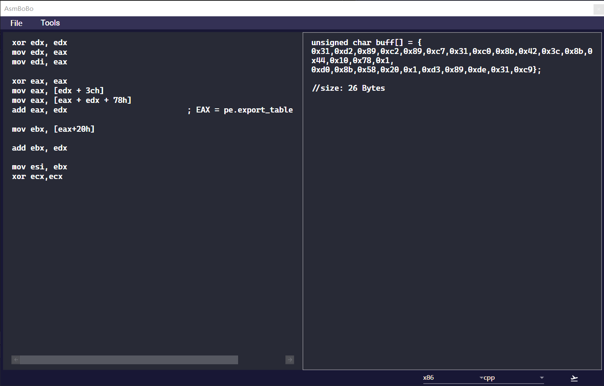

# ASMBoBo  
ASMBoBo一款简易的汇编与机器码的简易编辑器(融合了如字符串处理等功能)，是为了自己能够方便的将汇编语句转化为机器码以及C风格的Byte数组形式，同时方便即使更改等功能  
开发环境:&emsp;C#  
&emsp;&emsp;&emsp;&emsp;&emsp;WPF  
&emsp;&emsp;&emsp;&emsp;&emsp;vs2019  
汇编引擎使用了Keystone:  
https://www.keystone-engine.org/  
https://github.com/keystone-engine/keystone/tree/master/bindings/csharp  
结合了自己之前的命令行项目:  
https://github.com/Jhinxs/shellcode_gen

PS:汇编的语法风格以MASM为准

PS: 半成品不想搞了，主要是完全用汇编实现通用堆栈管理，各种api地址获取，应对各种复杂的api调用太烦了。有需要还是自己写shellcode或者同text代码段抠opcode吧